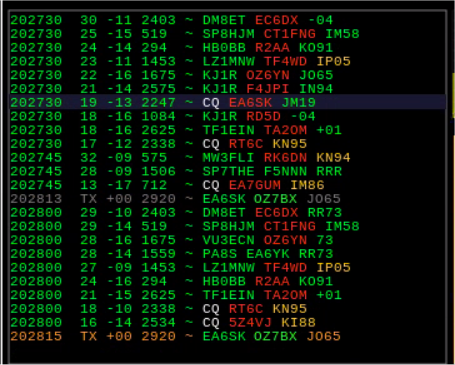
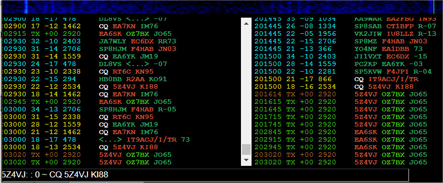

FT8 List Unix App

FT8 List Web App

# Improvements and fixes that I find useful.

(This branch is at this commit > 5 commits ahead of afarhan/sbitx:main from 2024 02 13.)

## Hardware

The hardware I use is sBitx V2 upgraded to V3 as described in the document:
sbitxv3 PA changes and measurements
https://docs.google.com/document/d/1HvpgnS6zuPcygxmB6lvFZztqSGPLlWYzVGHhytWvQG4/edit

## 2024 03 22:

sbitx-oz7bx v3.02.0010

N.B. two new sqlite indexes needs to be created:

    CREATE INDEX gridIx ON logbook (exch_recv);

    CREATE INDEX callIx ON logbook (callsign_recv);

Both the Unix App and the Web App now has the lists in FT8 mode decorated.
Callsigns of callers and grids that has been logged are now displayed in green,
and the ones not in the log are displayed in red.

An experimental world map with logged grids as red dots are displayed in the Web app.

## 2024 02 25:

Updated the code with 

Bechmans sound fix https://github.com/sbeckman/sbitx-clickfix and

sound output option: https://github.com/sbeckman/sbitx-sound-output-control 

## 2024 02 21:

Most of my improvements are related to the very useful web UI and FT8 mode.

The SAVE button has been renamed to LOG as it just opens the log tab.
Log and Qrz tabs are now opened or updated when the LOG or ? buttons are clicked.
The LOG OK button now works and saves the QSO in the web UI (Afarhan fixed this 2024 02 13).

New knob button for showing or hiding the dial knob (Instead of clicking the frequency field).
New Sound button for muting the sound (useful in FT8 mode).

In LSB or USB mode the web UI waterfall can be clicked on an interesting signal, and the signal will be centered and just need fine tuning.

The frequency field will now react on turning the mouse wheel.

The frequency STEP choices now has a 500H step size.
The bandwidth BW now steps from 50 to 5000 in steps of 50.

In FT8 mode, when a CQ XXXX GGGG is clicked the XXXX callsign is checked against the LOG. 
If the callsign is found the latest LOG info is shown on a line and a QSO is not started.
If the callsign was not found the QSO is started as before.
